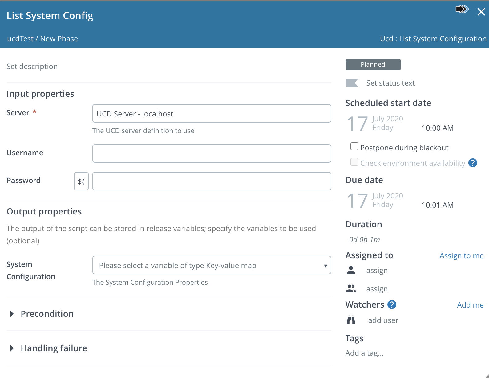
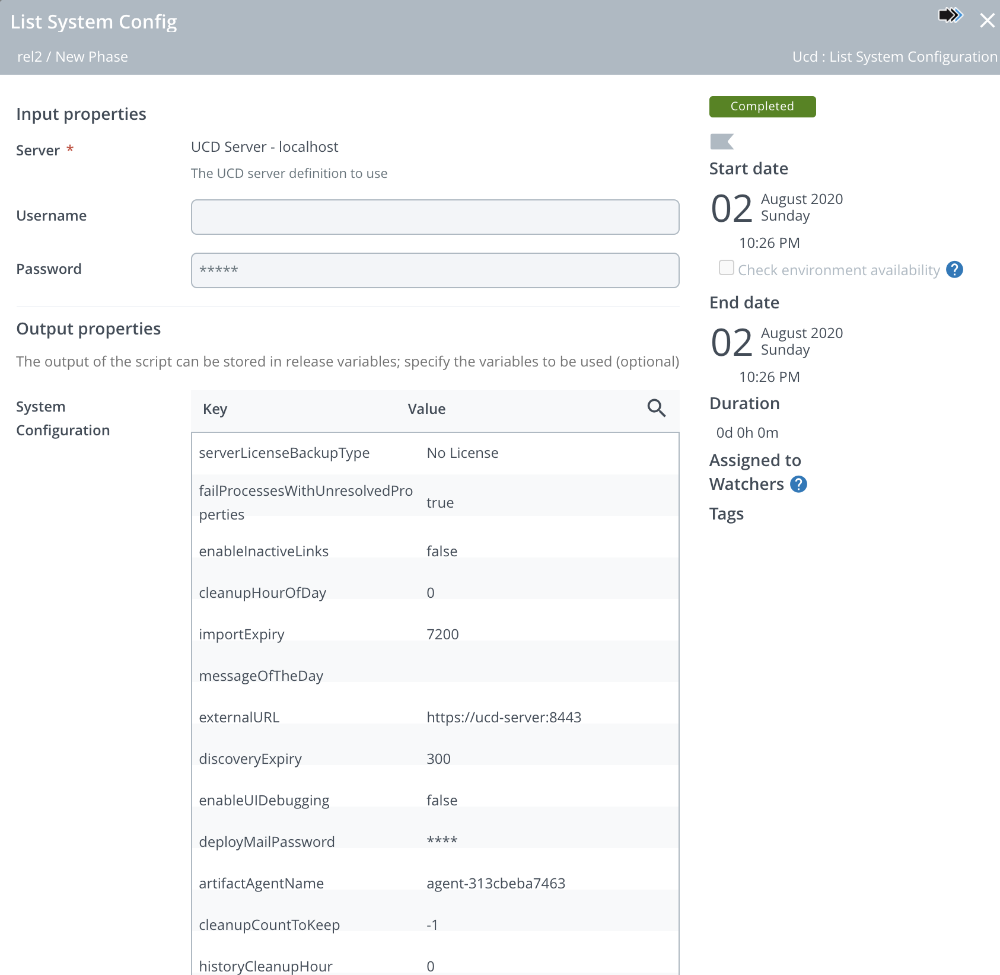
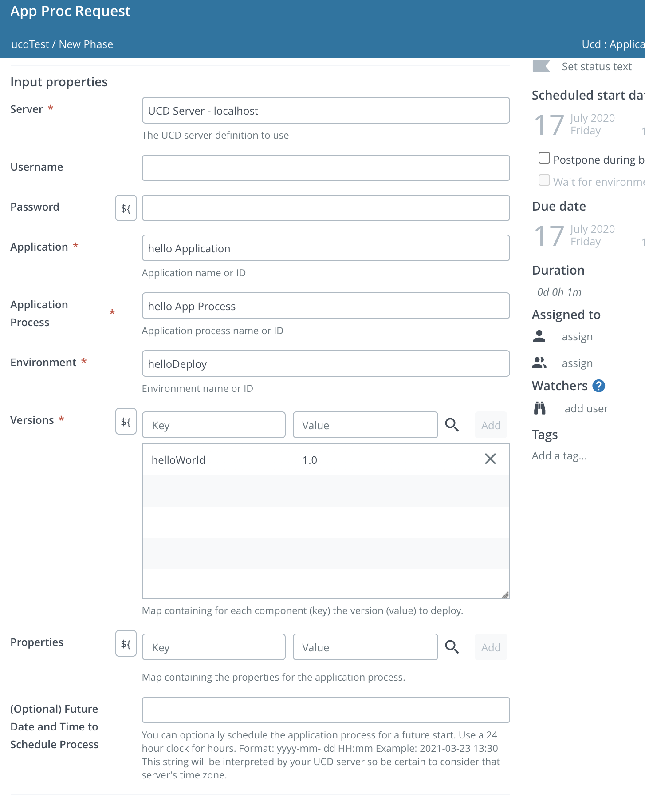
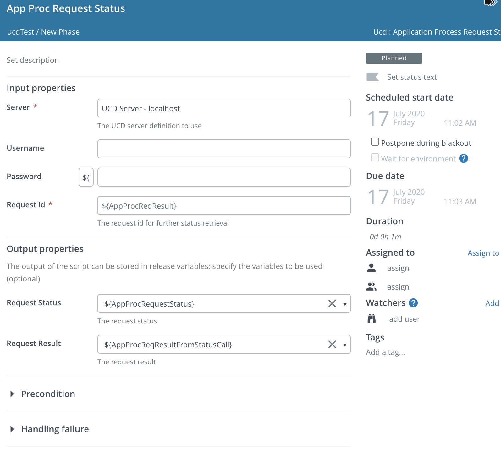
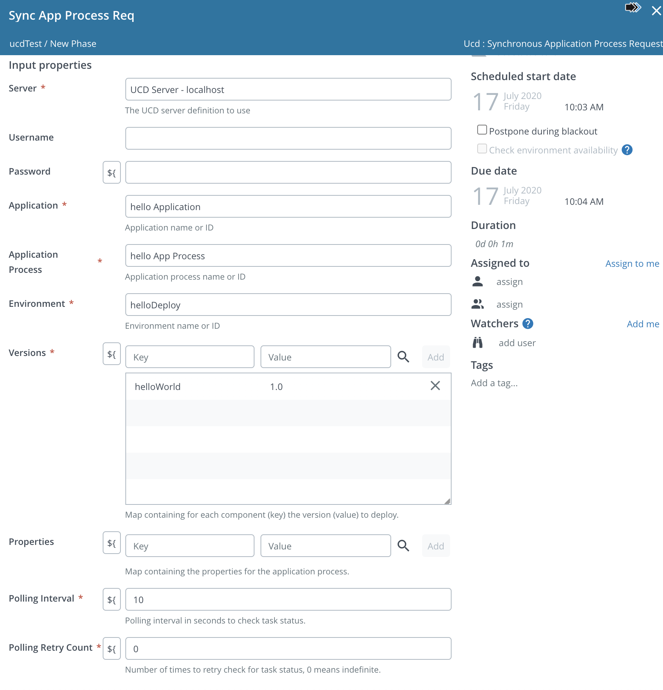
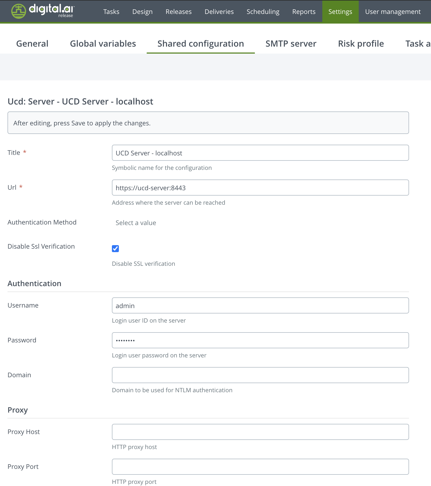

# XL Release UCD Plugin

[![Codacy Badge][xlr-ucd-plugin-codacy-image] ][xlr-ucd-plugin-codacy-url]
[![Code Climate][xlr-ucd-plugin-code-climate-image] ][xlr-ucd-plugin-code-climate-url]
[![License: MIT][xlr-ucd-plugin-license-image] ][xlr-ucd-plugin-license-url]
[![Github All Releases][xlr-ucd-plugin-downloads-image] ]()

This document describes the functionality provided by the XL Release xlr-ucd-plugin.

See the [XL Release reference manual](https://docs.xebialabs.com/xl-release) for background information on XL Release and release automation concepts.

This is a 'See It Work' plugin project, meaning the code base includes functionality that makes it easy to spin up and configure a dockerized version of the XebiaLabs platform with this plugin api already installed. Using the provided test data, you can then try out the plugin features. This is useful for familiarizing yourself with the plugin functionality, for demonstrations, for testing and for further plugin development. [See the Demo/Dev section.](#to-run-demo-or-dev-version-set-up-docker-containers-for-both-xlr-and-the-ucd-platform)

The plugin code base also includes a gradle task for [automatic integration testing](#to-run-integration-tests).

## Overview

This plugin offers an interface from XL Release to Urban Code Deploy Server.

## Requirements

Changes introduced in version 2.0.0 -
    1. Polling for tasks that retrieve Status information has been replaced with the Release Schedule Task mechanism. This allows tasks to resume even if Release is rebooted. If your template includes polling parameters, you will see an alert indicator in your task, but the task will still work without changes. 
    2. It is now possible to set a UCD Application Process Request for a future date/time deployment.

## Requirements

* XL Release**   9.8.0+
* This plugin has been tested with XL Release 9.8.0 and UCD 7.1.0

## Installation

* Copy the latest JAR file from the [releases page](https://github.com/xebialabs-community/xlr-ucd-plugin/releases) into the `XL_RELEASE_SERVER/plugins/__local__` directory.
* Restart the XL Release server.

## Usage

### List System Configuration

The List System Configuration task will list the system attributes as name value pairs.




### Application Process Request

The Application Process Request task will invoke an Application Process Request in UCD for the given Application, Application Process, Environment and Versions (as defined in UCD). If Future Date and Time is set, UDC will put the request into a pending state until that time. The Date/Time string must be in the format yyyy-mm-dd HH:mm ,use a 24 hour clock for hours. Example: 2021-03-23 13:30 .
The Application Process Request ID is retrieved for display or stored in an XL Release variable.



### Application Process Request Status

Given an Application Process Request ID, this task will poll UCD for the status of the request. The Request Status and Request Result are then output.



### Synchronous Application Process

The Synchronous Application Process task will invoke a UCD Application Process Request and then immediately poll for the status of that request. If Future Date and Time is set, UDC will put the request into a pending state until that time. The Date/Time string must be in the format yyyy-mm-dd HH:mm ,use a 24 hour clock for hours. Example: 2021-03-23 13:30 . The Request ID, Request Status and Request Result are output.



### Configure the UCD Server in XL Release



## Developers

Build and package the plugins with...

```bash
./gradlew assemble
```

### To run demo or dev version (set up docker containers for both XLR and UCD platform)

NOTE:

1. Clone this git project to your local dev environment
2. You will need to have Docker and Docker Compose installed.
3. The XL-Release docker image uses the community trial license
4. You will need to be able to run a bash script
5. You will need to have [curl](https://curl.haxx.se/) and [jq](https://stedolan.github.io/jq/) installed
6. XL Release will run on the [localhost port 15516](http://localhost:15516/).
7. The XL Release username / password is admin / admin.
8. The UCD Server runs on the [localhost port 8443](https://localhost:8443/)
9. The UCD username / password is admin / admin

* Before running the demo, be sure to create the plugin by opening a terminal, cd into the plugin source code directory, and run

```bash
./gradlew clean build
```

* To run the dev/demo mode, open a terminal, cd into the src/test/resources/docker directory of the plugin code and run

```bash
docker-compose up
```

* After XLR and the UCD Platform starts up, open a terminal in the directory src/test/resources/docker/initialize and run

```bash
./initialize_demo.sh
```

* This will populate both XLR and the UCD Server with the demo data. You can then log into XLR, create and then run a release based upon the imported template name 'ucdTest'.

* To shut down and remove the docker containers - in a terminal, cd to the src/test/resources/docker directory, and run

```bash
docker-compose down
```

## References

+ [UCD REST api](https://www.ibm.com/support/knowledgecenter/SS4GSP_7.1.0/com.ibm.udeploy.reference.doc/topics/rest_api_ref_commands.html)


[xlr-ucd-plugin-codacy-image]: https://api.codacy.com/project/badge/Grade/da9c2f00342c40ad8efc7fbd1aaec063
[xlr-ucd-plugin-codacy-url]: https://www.codacy.com/app/joris-dewinne/xlr-ucd-plugin
[xlr-ucd-plugin-code-climate-image]: https://codeclimate.com/github/xebialabs-community/xlr-ucd-plugin/badges/gpa.svg
[xlr-ucd-plugin-code-climate-url]: https://codeclimate.com/github/xebialabs-community/xlr-ucd-plugin
[xlr-ucd-plugin-license-image]: https://img.shields.io/badge/License-MIT-yellow.svg
[xlr-ucd-plugin-license-url]: https://opensource.org/licenses/MIT
[xlr-ucd-plugin-downloads-image]: https://img.shields.io/github/downloads/xebialabs-community/xlr-ucd-plugin/total.svg